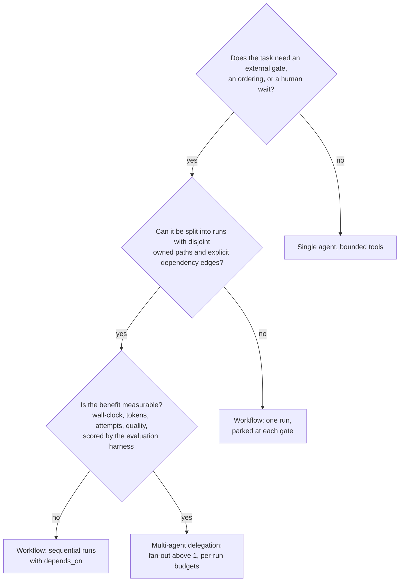

# Delegation guide: one agent, a workflow, or several agents

Audience: operator, developer. Category: developer docs / operator docs
(see [README.md → 5. Developer docs](README.md#5-developer-docs)).

Epic [#806](https://github.com/decarvalhoe/ORDO/issues/806), child
[#814](https://github.com/decarvalhoe/ORDO/issues/814). The plan fixed the
default — **one agent with bounded tools** — and allowed multi-agent
fan-out only when the decomposition and quality benefit are measurable.
This page turns that decision into criteria an operator can apply before
dispatching, names the ORDO mechanism for each shape, and states the two
boundaries (MCP, A2A) that never become part of the authorisation or state
model.

## The three shapes

| Shape | What it is in ORDO terms | Default? |
| --- | --- | --- |
| **Single agent, bounded tools** | One run, one attempt at a time, one pane (or one fake runtime), a brief with objective / allowed sources / boundaries / definition of done, a budget, and the provider adapter as its only way to the forge. | **Yes.** Start here. |
| **Workflow** | Several runs the scheduler drives: dependencies (`--depends-on`), readiness verdicts, human-wait states, approvals, retries with backoff, timeouts and per-run budgets. Still one agent at a time per run; the *sequence* is what is orchestrated. | When the work has gates or ordering. |
| **Multi-agent delegation** | Several runs leased at once (`ORDO_SCHED_MAX_FANOUT > 1`), each with its own pane, worktree, brief and budget, and disjoint owned paths. | Only with a measured benefit. |

Two shapes the plan rules out: unbounded autonomous swarms and broadcast
group-chat orchestration. ORDO has no primitive for either, on purpose.

## Decision criteria

Ask the questions in order; the first "no" picks the shape.

### 1. Single agent with bounded tools (default)

Use it when the ticket is one coherent change with a clear definition of
done. The bounds are what make it safe, and every one of them is a knob or
a contract, not a prompt instruction:

- **Scope**: the brief's owned paths and boundaries; the dispatch matrix
  refuses overlapping `owned_paths` (exit 82) and a second active issue on
  one agent (exit 83).
- **Tools**: the runtime adapter (`start inspect signal stop
  collect_evidence recover`) and the provider adapter's twenty ops. Reads
  are free; mutations require an idempotency key and a gate scope, and the
  actions that matter (`pr.merge`, `pr.ready`, `issue.close`, …) go through
  an approval.
- **Budget**: `max_turns`, `max_tool_calls`, `max_seconds`, `max_tokens`,
  `max_cost`, `max_attempts` — enforced on every heartbeat (exit 7).
- **Evidence**: pane captures as artifacts, provider receipts, journal
  events, spans. "Done" is a `run.succeeded` with evidence, not a chat
  message.

Signals that a single agent is the wrong shape: the brief lists more than
one definition of done; the agent must wait for CI, a review or a human
more than once; the work touches a hotspot another agent owns.

### 2. Workflow (scheduler-driven runs)

Use it when the *sequence* carries risk: CI must be green before a merge,
a review must be granted, a dependency must land first, a step may need
retrying. The scheduler owns the sequence so no agent has to remember it:

| Need | Mechanism |
| --- | --- |
| Wait for an external system | `ordo_scheduler_wait --deadline` → `waiting`, lease released; `ORDO_SCHED_WAIT_TIMEOUT_SEC` expires it |
| Wait for a human | `ordo_scheduler_require_approval --action A` → `approval_required`; request → grant → `authorize-and-run` → `ordo resume` |
| Order two runs | `enqueue --depends-on run_a` — picked only once `run_a` is `succeeded` (unknown or any other state = not ready) |
| Trust a readiness verdict | `run.updated {"metadata":{"readiness":{"state":"ready"}}}` written by the planner; `ORDO_SCHED_REQUIRE_READINESS=1` to demand one |
| Retry a failed step | `ORDO_SCHED_MAX_RETRIES`, exponential backoff with jitter, `not_before` honoured by the pick |
| Bound a step | `ORDO_SCHED_RUN_TIMEOUT_SEC` of *active* time per attempt (a two-hour approval wait does not count) |
| Survive a crash | `ordo_scheduler_recover`: rebuild, sweep stale leases, requeue `owner_dead` runs, attempts preserved |

A workflow is still one agent at a time per run; fan-out stays at its
default (`ORDO_SCHED_MAX_FANOUT=2` slots, which is capacity for two
*independent* runs, not parallelism inside one).

### 3. Multi-agent delegation (fan-out)

Use it only when all three hold and you can show it:

1. **Decomposition is real.** Each run has disjoint owned paths (the
   matrix conflict check must pass), its own worktree and branch, and the
   dependency edges between runs are explicit `depends_on`, not implied.
2. **The benefit is measurable.** Run the decomposed and the single-run
   version through the evaluation harness ([evaluation.md](evaluation.md))
   or a comparable trajectory and compare `elapsed_seconds`,
   `tokens_used`, `attempts_used`, `mutations_executed` and the quality
   gate you care about. If the fan-out does not beat the single run on the
   dimension that motivated it, do not ship the fan-out. "It felt faster"
   is not a measurement.
3. **Every run is bounded on its own.** Per-run budgets, per-run
   approvals, per-run evidence. A fan-out that shares one budget or one
   approval across runs is a swarm, not delegation.

Signals that fan-out is the wrong shape: runs keep parking `blocked` on
each other's hotspots; a coordinator run spends its budget relaying
messages; the merge order matters more than the parallelism gained.

### Budgets by shape

| Budget | Single agent | Workflow | Multi-agent |
| --- | --- | --- | --- |
| `max_attempts` (`ORDO_SCHED_MAX_RETRIES` + 1) | per run | per run, retries drive the backoff | per run; never pooled |
| `max_seconds` / `ORDO_SCHED_RUN_TIMEOUT_SEC` | per attempt of active time | idem; human waits excluded | idem |
| `max_turns`, `max_tool_calls`, `max_tokens`, `max_cost` | per run, on every heartbeat | per run | per run |
| Fan-out (`ORDO_SCHED_MAX_FANOUT`) | 1 slot used | 1 slot used at a time | N slots; `resume` refuses when full (exit 7 `max_fanout`) |
| Queue / wait TTL | optional | recommended (`ORDO_SCHED_QUEUE_TTL_SEC`, `ORDO_SCHED_WAIT_TIMEOUT_SEC`) | required — an orphaned parked run holds a place in the queue |

Defaults and per-run overrides: [scheduler.md → Budgets](scheduler.md#budgets).

## Rules that hold for every shape

- **Models never authorise mutations.** An actor of type `model` may
  *request* an approval and *report* usage; it may not grant, deny or
  execute one (exit 3, journaled as a `policy_decision` deny). The
  deterministic code — the gate, the bridge, the scheduler — owns
  authorisation, persistence, scheduling and irreversible mutation. LLMs
  plan and classify; they are inputs to a decision, never the decider.
- **Every external mutation is idempotent and gated.** No idempotency key,
  no call; no gate scope, no call; a replay is a read.
- **Evidence before claims.** A run's completion is its `run.succeeded`
  event plus artifacts, receipts and spans — not the agent's report.
- **Human waits release the slot.** Never keep a worker leased to wait on
  a person; park the run.
- **Fail closed.** Unknown readiness, unknown run, drifted policy version,
  expired approval, missing provider capability — each one refuses.

## The MCP boundary

MCP (Model Context Protocol) is a **tool and context interoperability
boundary**: it is how an agent CLI reaches a Figma file, a browser, a
database. ORDO treats it exactly that way and no further:

- **MCP tool metadata is never trusted authorisation** (a stop condition of
  the plan). A tool that describes itself as "safe", "read-only" or
  "approved" changes nothing in ORDO: authorisation is the external
  mutation gate (`ORCH_EXTERNAL_PR_MUTATIONS`) plus a typed approval
  record re-checked by the bridge, and both live outside the agent's
  process.
- **MCP is not a workflow engine.** No run state, lease or approval is
  stored or advanced through an MCP server; the journal is the only state
  model.
- **What ORDO does with MCP**: the dispatch preflight refuses a brief that
  needs an MCP the target agent is not allowed to use (exit 80,
  `ORCH_MCP_PERMISSION_BLOCKED_EXIT_CODE`), so the permission decision is
  the operator's, made before dispatch, and audited. Forge access is *not*
  delegated to an MCP server: agents reach issues and pull requests
  through the provider adapter, where the gate and the ledger apply.

## The A2A boundary

A2A (agent-to-agent protocols) is an **optional boundary for independent
remote agents** — another organisation's agent, a hosted service, a
different orchestrator — and explicitly not ORDO's internal state model:

- Inside a fleet, agents do not talk to each other. Work is dispatched by
  the orchestrator slot, results come back as branches, pull requests and
  evidence; ORDO's `AGENTS.md` forbids worker-to-worker dispatch.
- A remote agent reached over A2A is modelled like any external system:
  a run parks `waiting` with a deadline, the interaction is recorded as
  `provider.read`-style events or a `blocker` with an `external_ref`, and
  anything the remote agent proposes that would mutate a forge still
  enters through the provider adapter, the gate and an approval. The
  remote agent's own state machine is its business; ORDO keeps its own.
- No ORDO module depends on an A2A implementation, and none is planned as
  a dependency: the plan lists Temporal, Kubernetes, LangGraph, CrewAI,
  AutoGen and any single model vendor as things ORDO must not require.

## Three worked examples

| Ticket | Shape | Why |
| --- | --- | --- |
| "Fix the flaky test in `tests/foo.bats`" | Single agent | One definition of done, one owned path, no external gate before the PR. Budget: defaults. |
| "Land the schema change, then migrate the callers, then merge behind review" | Workflow | Three runs with `depends_on`, a `pr.merge` approval on the last; each parks while CI runs. One agent at a time. |
| "Port the twenty provider ops to a new forge" | Multi-agent, after measurement | Ops split by disjoint files, no dependency between them, and a baseline run of the eval harness per op shows the split cuts wall-clock without raising attempts. Fan-out 3, per-run budgets, one approval per merge. |
