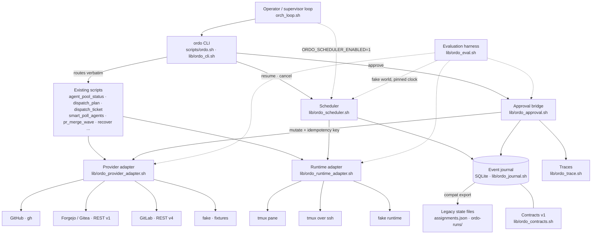
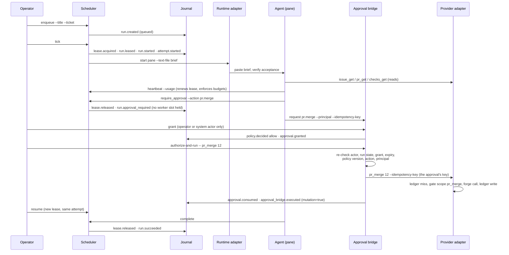

# ORDO hybrid architecture: shell-first scripts plus a durable control plane

Audience: developer, integrator, operator. Category: developer docs
(see [README.md → 5. Developer docs](README.md#5-developer-docs)).

Epic [#806](https://github.com/decarvalhoe/ORDO/issues/806), child
[#814](https://github.com/decarvalhoe/ORDO/issues/814). This page is the map
of the agentic control plane: how the pieces that the children of the epic
delivered fit together, what each one owns, and what none of them may do.
The per-module pages carry the field-level detail; the reading order is at
the end.

## Why "hybrid"

ORDO stayed a **shell-first toolkit**: `scripts/*.sh` are still the reference
implementation of every operator workflow (status, plan, dispatch, watch,
merge, recover), their flags, output and exit codes are unchanged, and the
431 pre-existing Bats tests plus the shell suite still run against them
untouched. The epic did not rewrite them into a framework runtime — that was
a stop condition of the plan.

What changed is that those scripts now sit on a **durable, auditable
substrate**: a canonical run model with typed contracts, an append-only
SQLite journal, a scheduler with leases and budgets, forge-neutral provider
adapters, a human approval gate that deterministic code re-checks before any
external mutation, OpenTelemetry-compatible traces, and an evaluation harness
that replays whole trajectories in a fake world. Every one of those layers is
additive and opt-in; the substrate wraps the scripts, it never replaces them.

Solid arrows are calls; dotted arrows are opt-in hooks. The forge boxes on
the right are interchangeable through one variable
(`ORDO_PROVIDER_ADAPTER`), which is what "forge-neutral" means in practice:
the organisation runs on Forgejo, GitHub stays supported, GitLab works, and
no `gh` vocabulary crosses the adapter boundary.

## The components and what each one owns

| Layer | Library / entry point | Owns | Never does | Page |
| --- | --- | --- | --- | --- |
| Contracts | `lib/ordo_contracts.sh`, `contracts/v1/emit.sh` | The ten object kinds (run, task, attempt, agent, lease, event, approval, artifact, policy_decision, blocker), the three transition tables, validation, redaction, the error object and exit-code map. | Store anything, call anything. | [contracts.md](contracts.md) |
| Journal | `lib/ordo_journal.sh` | Append-only events with a gapless per-run sequence, pure projections, lease and approval rows, the compatibility export of legacy state files. | Perform a side effect during replay; own policy. | [journal.md](journal.md) |
| Scheduler | `lib/ordo_scheduler.sh`, `scripts/ordo_scheduler.sh` | Who runs, under which lease, for how long, within which budget; retries, backoff, timeouts, cancellation, crash recovery, fail-closed readiness. | Call a model; turn missing provider data into readiness. | [scheduler.md](scheduler.md), [state-machine.md](state-machine.md) |
| Unified CLI | `scripts/ordo.sh`, `lib/ordo_cli.sh` | One entry point (`status plan dispatch watch resume approve cancel recover merge`), routing to the existing scripts, JSON/human output modes, structured errors. | Change a routed script's behaviour or exit code. | [cli.md](cli.md) |
| Runtime adapter | `lib/ordo_runtime_adapter*.sh` | `start inspect signal stop collect_evidence recover` against tmux, tmux-over-ssh or a fake. | Decide what to run. | [adapters.md](adapters.md) |
| Provider adapter | `lib/ordo_provider_adapter*.sh` | Twenty forge-neutral ops with one normalised JSON shape each; the mutation policy (`ORCH_EXTERNAL_PR_MUTATIONS`), the idempotency ledger; GitHub, Forgejo/Gitea, GitLab and fake backends. | Leak a token; execute a mutation without an idempotency key. | [adapters.md](adapters.md), [providers.md](providers.md) |
| Approval bridge | `lib/ordo_approval.sh`, `scripts/ordo_approve.sh` | Typed approvals bound to one run, action, principal, policy version and expiry; re-authorisation immediately before execution; `policy_decision` records. | Let an actor of type `model` grant, deny or execute; widen the gate. | [approvals.md](approvals.md) |
| Traces | `lib/ordo_trace.sh` | Spans of kind agent/model/tool/policy/approval/retry/provider, one trace per run, OTLP/JSON export, redaction before write. | Push anything anywhere on its own. | [tracing.md](tracing.md), [../otel-export.md](../otel-export.md) |
| Evaluation | `lib/ordo_eval.sh`, `scripts/ordo_eval.sh` | Scenarios in a fake world on a pinned clock, six score dimensions, failure injection, the committed baseline. | Touch a forge, tmux or a credential. | [evaluation.md](evaluation.md), [demo.md](demo.md) |

Every layer reports failure the same way — one JSON line on stderr and an
exit code from the shared table in
[../exit-codes.md → Agentic control plane](../exit-codes.md#agentic-control-plane-scriptsordosh-and-libordo_sh)
— and every layer is stdlib-only: bash, jq, python3 (for SQLite), coreutils.

## One run, end to end

The sequence below is the story the demo replays
([demo.md](demo.md)); the same story with a tmux pane and a real forge only
changes the two adapter selections.

Three properties of that sequence are load-bearing:

1. **The model never decides.** Grant, deny and execution are refused for
   `actor.type == "model"` (exit 3) and the refusal itself is journaled as
   a `policy_decision`. Models plan, classify and report usage; code
   authorises, persists, schedules and mutates.
2. **Replay never repeats a side effect.** Every mutating event and every
   approval carries an `idempotency_key` by schema; the provider ledger
   returns the recorded receipt for a known key without calling the forge;
   the journal refuses a duplicate key with the stored event on stdout.
   Recovery after a crash is therefore a read.
3. **Human waits cost nothing.** `waiting`, `blocked` and
   `approval_required` release the lease on entry, so a run parked for a
   two-hour review holds no worker slot and no runtime process.

## Where the fast-check / merge-time split lives

[docs/architecture.md](../architecture.md) — the tiered CI strategy — is
unchanged and still governs how work reaches the default branch:

- **Tier 1** (fast checks on every push) still belongs to the product
  repository's CI. The control plane does not run it and does not replace
  it. On Forgejo or GitLab the tier is simply that forge's pipeline; the
  provider adapter reads its verdict through `checks_get` / `run_list`
  with the same `pass | fail | pending | none` vocabulary on every forge.
- **Tier 2** (merge-time orchestration) is still `integrate_wave.sh` →
  optional sanity gate → `lib/pr_merge.sh` waiting for CI and refusing to
  bypass a red or pending state. What changed underneath: `pr_merge.sh`
  now talks to the forge through `ordo_provider` (so it needs the merge
  scopes listed in [migration.md](migration.md)), and an operator can put
  the merge behind a typed approval executed through the bridge, which
  adds a per-action human gate on top of the CI gate — never instead of it.

The scheduler does not reorder merges and the journal does not decide
mergeability; they record and bound the work that leads to a merge.

## Storage layout

Everything the control plane persists lives under the per-project state
directory `state_dir()` (`$ORCH_STATE_BASE/$PROJECT`, the same directory
the legacy scripts already use) and is additive to the legacy files:

| Path under `state_dir` | Written by | Purpose |
| --- | --- | --- |
| `ordo-journal.sqlite` (+ `-wal`, `-shm`) | journal | The event journal, projections, leases, approvals. The only source of truth of the new model. |
| `ordo-runs/<run_id>.json` | journal (compat export) | Per-run snapshot, pretty-printed, for humans and legacy tooling. |
| `assignments.json` | legacy scripts, and the compat export for rows it owns | The legacy ledger, unchanged shape. |
| `ordo-journal-compat.json` | journal (compat export) | Which `assignments.json` rows the journal owns. |
| `ordo-provider-idempotency.jsonl` | provider adapter | Mutation receipts keyed by idempotency key. |
| `traces/<trace_id>.jsonl`, `traces/spans.index` | traces | One trace per run (`trace_id = sha256(run_id)[0:32]`). |
| `runtime-evidence/` | runtime adapter | Token-masked pane captures with sha256. |

The audit log (`$ORCH_LOG_DIR/<project>.log`) keeps receiving one line per
decision (`SCHEDULER TICK …`, `EXTERNAL_PR_MUTATION action=… mode=allowed|refused …`),
so an operator who never opens the journal still sees everything.

## Invariants the whole design rests on

These come from the plan's stop conditions and are enforced by tests, not
by convention:

- Existing scripts are wrapped, never rewritten; their tests run unchanged.
- No model owns authorisation, persistence, scheduling or irreversible
  mutation — `tests/ordo_approval.bats`, `tests/ordo_eval.bats` (`policy_compliance`).
- Event replay never repeats a non-idempotent side effect —
  `tests/ordo_journal.bats`, `tests/ordo_provider_adapter.bats`, the
  `duplicate_delivery` and `process_crash` scenarios.
- State migration reproduces the pre-migration status output — the
  byte-for-byte `assignments.json` test in `tests/ordo_journal.bats`.
- Missing provider data never becomes readiness — `ordo_scheduler_ready`,
  the `blocked_run` scenario, `details.capability="unsupported"` on forges
  without an Actions API.
- MCP tool metadata is never trusted authorisation — see
  [delegation-guide.md](delegation-guide.md).
- Provider-, model- and framework-neutral; no runtime dependency beyond
  bash, jq, python3 (stdlib), tmux for real panes.

## Reading order

1. This page, then [state-machine.md](state-machine.md) for the vocabulary.
2. [contracts.md](contracts.md) → [journal.md](journal.md) → [scheduler.md](scheduler.md): the substrate.
3. [adapters.md](adapters.md) → [providers.md](providers.md): the boundaries to the runtime and the forge.
4. [approvals.md](approvals.md) → [tracing.md](tracing.md): mutation safety and evidence.
5. [cli.md](cli.md): the operator surface.
6. [evaluation.md](evaluation.md) → [demo.md](demo.md): run it with nothing but bash, jq and python3.
7. [delegation-guide.md](delegation-guide.md): when to use one agent, a workflow, or several agents.
8. [migration.md](migration.md): adopting, rolling back and upgrading.
