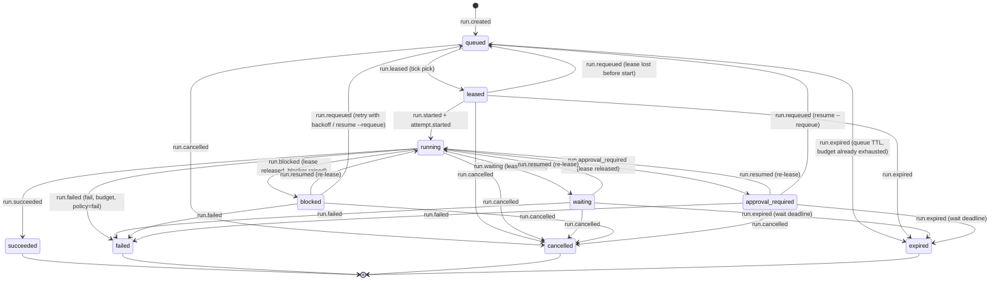

# ORDO durable scheduler

Audience: developer, operator. Category: developer docs / API reference.

`lib/ordo_scheduler.sh` (issue #810, epic #806) is the execution substrate of
the agentic control plane: it decides which run may execute, under which
lease, for how long and within which budget. It is a state machine folded
over the event journal ([journal.md](journal.md)); every change is a journal
event validated against the run transition table of
[contracts.md](contracts.md), never a direct table write. Nothing here calls
a model: the scheduler is deterministic code, and a model can only *report*
usage or ask to be parked.

The operator entry point is `scripts/ordo_scheduler.sh`; the unified CLI
routes `ordo resume` and `ordo cancel` to it ([cli.md](cli.md)).

## Where things live

| Path | Content |
| --- | --- |
| `lib/ordo_scheduler.sh` | The library: state machine, tick, heartbeat, retry policy, budgets, readiness, recovery, runtime indirection. |
| `scripts/ordo_scheduler.sh` | Operator entry point: `tick`, `run-once`, `enqueue`, `resume`, `cancel`, `recover`, `status`. |
| `scripts/orch_loop.sh` | Opt-in hook `orch_scheduler_tick_step` (`ORDO_SCHEDULER_ENABLED=1`). |
| `tests/ordo_scheduler.bats` | Deterministic suite (pinned clock): states, leases, backoff, timeouts, cancel, recovery, budgets, human waits, readiness, exit codes, loop hook. |
| `tests/cli/ordo_cli.bats` | `ordo resume` / `ordo cancel` routing and the real-script round trip. |
| `$(state_dir)/ordo-journal.sqlite` | The only storage (through `lib/ordo_journal.sh`). |

## State machine



Rules that follow from the table:

- `waiting`, `blocked` and `approval_required` are **human-wait states**: the
  lease is released on entry, so the run holds no worker slot and no
  runtime process is bound to it. Capacity is available again immediately.
- `running -> queued` is not allowed, so a running run that loses its lease
  or times out goes through `blocked` (with a `blocker.raised` of type
  `lease_expired` / `timeout` / `owner_dead`) and then `run.requeued`
  (the blocker is resolved on the same tick). The journal shows the full
  path.
- `queued -> failed` is not allowed, so a queued run whose budget is already
  exhausted before any pick is `expired` with `reason=budget_exhausted`.
- Every refused transition is exit 5 `invalid_transition` (module
  `scheduler`, `details.allowed` lists the targets) and appends nothing.
- `ordo_journal_project` is pure, so `ordo_journal_rebuild_all` always
  reproduces the scheduler state from the events.

## Public API

```bash
source lib/audit_log.sh; source lib/state_persist.sh   # PROJECT, state_dir
source lib/ordo_scheduler.sh                            # sources ordo_journal.sh + ordo_contracts.sh

ordo_scheduler_enqueue [--run-id ID] [--title T] [--ticket REF] [--priority N] [--budget JSON]
    [--metadata JSON] [--depends-on run_a,run_b] [--readiness JSON] [--not-before TS]
    [--expires-at TS] [--max-retries N] [--runtime-target T --text-file F] [--actor JSON]
ordo_scheduler_tick [--max-picks N] [--actor JSON]                       # one pass, JSON report
ordo_scheduler_heartbeat <run_id> [--usage JSON]                         # renew + usage + budgets (7)
ordo_scheduler_report_usage <run_id> <usage-json>                        # usage without renewing
ordo_scheduler_wait <run_id> [--reason R] [--deadline TS]                # running -> waiting
ordo_scheduler_block <run_id> [--reason R] [--type T]                    # running -> blocked
ordo_scheduler_require_approval <run_id> [--action A] [--reason R] [--deadline TS]
ordo_scheduler_resume <run_id> [--requeue] [--reason R]                  # re-lease, or back to queued
ordo_scheduler_complete <run_id> [--result JSON]                         # running -> succeeded
ordo_scheduler_fail <run_id> [--reason R]                                # -> failed (authority)
ordo_scheduler_cancel <run_id> [--reason R]                              # any non-terminal -> cancelled
ordo_scheduler_recover                                                   # rebuild + dead-owner reconciliation
ordo_scheduler_status [run_id]                                           # JSON summary
ordo_scheduler_ready <run_id>        # readiness verdict; 3 fail_closed when not ready
ordo_scheduler_budgets <run_id>      # budget verdict; 7 budget_exhausted
ordo_scheduler_backoff_seconds <n>   # pure schedule
ordo_scheduler_owner                 # <worker>@<host>:<pid>
ordo_scheduler_runtime <op> [args]   # -> ordo_runtime, no-op when ORDO_RUNTIME_ADAPTER=fake or the lib is absent
```

Worker-side calls (`heartbeat`, `wait`, `block`, `require_approval`,
`complete`) require the live lease to be owned by the caller
(`ordo_scheduler_owner`); otherwise exit 8 `lease_lost`. `fail`, `cancel`,
`resume` and `recover` are authority calls (operator / supervisor) and act on
whatever lease exists. Every function prints one JSON line on success.

### Operator script

```
scripts/ordo_scheduler.sh <project_short|config_path> <command> [args] [--json]
  tick [--max-picks N] | run-once | enqueue ... | resume <run_id> [--requeue] [--reason R]
  cancel <run_id> [--reason R] | recover | status [run_id]
```

The command word may appear anywhere after the project — the `ordo` CLI
appends it (`ordo cancel <project> <run_id> --reason R` runs
`ordo_scheduler.sh <project> <run_id> --reason R cancel`). `--json` prints
the library object; otherwise a short human line. The worker pid recorded in
the lease owner is the script's parent (`$PPID`: the supervisor loop or the
operator shell), overridable with `ORDO_SCHED_WORKER_PID`.

## Tick algorithm

`ordo_scheduler_tick` is one scheduling pass; it is idempotent for a pinned
clock and safe to run from several workers (leases are exclusive in the
journal).

Process budget (#817): the tick reads the journal ONCE
(`ordo_journal_tick_view`: stale leases, the non-terminal runs' snapshots,
slots in use, a `run_id -> state` map used for dependency readiness) and
re-reads it only after a step that wrote something; every state change of a
run — lease operation plus its events — is ONE journal transaction
(`ordo_journal_batch`), so an idle tick costs one `python3` process and a
pick costs one more. The same holds for the worker/authority commands:
`heartbeat`, `wait`/`block`/`require_approval`, `complete`, `fail`, `cancel`
and `resume` read the snapshot once and write once.

1. **Sweep stale leases** — the view's `stale_leases` are expired in one
   `ordo_journal_batch` (lenient `lease_expire` ops, exactly what
   `ordo_journal_lease_expire_stale` does); each expired lease's run goes
   through the retry policy with reason `lease_expired`
   (`ORDO_SCHED_LEASE_EXPIRY_POLICY`).
2. **Housekeeping per non-terminal run**
   - `running`: if `now - active_since >= ORDO_SCHED_RUN_TIMEOUT_SEC`,
     release the lease and apply the retry policy with reason `timeout`
     (`ORDO_SCHED_TIMEOUT_POLICY`); else, when the lease is owned by this
     worker and `now - heartbeat_at >= ORDO_SCHED_HEARTBEAT_SEC`, heartbeat
     it (budgets enforced; exhaustion fails the run). A running run without
     a live lease is treated as a lease loss.
   - `leased` without a live lease: retry policy (`lease_expired`).
   - `queued` past `metadata.expires_at`: `run.expired` (`queue_ttl`).
   - `waiting` / `approval_required` past `metadata.wait_deadline`:
     `run.expired` (`wait_timeout`).
3. **Pick** — capacity = `ORDO_SCHED_MAX_FANOUT - |leased ∪ running|`
   (bounded by `--max-picks`). Queued runs are ordered by
   `metadata.priority` ascending (lower first, default 100), FIFO within a
   priority (projection row order = enqueue order). For each candidate:
   skip if `not_before > now`; **budgets** (expire with
   `budget_exhausted` if already exhausted); **readiness** (fail-closed,
   skip with the reason; dependency states come from the view's map, kept
   current with the picks made earlier in the same pass); acquire the lease
   (`owner = <worker>@<host>:<pid>`, TTL `ORDO_SCHED_LEASE_TTL`),
   `run.leased`, `run.started` and `attempt.started` in one transaction —
   when `metadata.runtime.target` is set, the lease + `run.leased` commit
   first, the runtime target is started through `ordo_scheduler_runtime
   start` (a failure releases the lease and requeues with reason
   `runtime_start_failed`, in one transaction), then `run.started` +
   `attempt.started` commit.

The report lists `expired_leases`, `requeued`, `failed`, `expired`,
`timed_out`, `heartbeats`, `picked`, `skipped` (with reasons
`capacity_exhausted`, `not_before`, `readiness_*`, `dependency_*`,
`blockers_open`, `leased_elsewhere`) and `errors`; it is audited as
`SCHEDULER TICK ...`.

## Leases, heartbeats, retries, timeouts

| Mechanism | Semantics |
| --- | --- |
| Lease | Exclusive per run, TTL `ORDO_SCHED_LEASE_TTL` (300 s). Owner `<ORDO_SCHED_WORKER_ID>@<ORDO_SCHED_HOST>:<ORDO_SCHED_WORKER_PID>`; the loop uses `orch-loop@<host>:<loop pid>`. Acquired on pick and on resume; released on every park, completion, failure, cancellation — in the same journal transaction as the run event (a lenient `lease_release` op: a lease that is no longer live is skipped, a live lease past its expiry is expired instead, as the best-effort release always did). |
| Heartbeat | `ordo_scheduler_heartbeat` renews the lease (generation +1, `expires_at = now + TTL`), appends `run.budget` with `usage.seconds = now - heartbeat_at` plus the caller's usage, then enforces budgets. The tick heartbeats its own leases every `ORDO_SCHED_HEARTBEAT_SEC` (60 s). |
| Lease loss | A stale lease (past `expires_at`) makes heartbeat/complete exit 8 `lease_stale`; once swept it is `lease_lost`. The run is requeued (`blocked -> queued`) or failed per `ORDO_SCHED_LEASE_EXPIRY_POLICY`. |
| Retry policy | `requeue` when `attempts_used < max_attempts` (`max_attempts = ORDO_SCHED_MAX_RETRIES + 1`, per-run `--max-retries` / `budget.max_attempts`), else `run.failed` with `reason=budget_exhausted`, `cause=<lease_expired|timeout|owner_dead|runtime_start_failed>`. Attempts are never reset. |
| Backoff | `delay = min(ORDO_SCHED_BACKOFF_MAX_SEC, ORDO_SCHED_BACKOFF_BASE_SEC * 2^retries)` (retries = attempts so far - 1: 30, 60, 120, ... 1800 s). With `ORDO_SCHED_JITTER=1` (default) "equal jitter": `delay/2 + random(0..delay/2)`; `ORDO_SCHED_JITTER=0` makes the schedule exact. Recorded as `metadata.not_before` on the `run.requeued` event; the pick skips the run until then. Recovery requeues use no backoff. |
| Timeout | `ORDO_SCHED_RUN_TIMEOUT_SEC` (3600 s, 0 = off) of **active** time per attempt (`metadata.active_since`, reset by `resume` so a two-hour approval wait does not time the run out). `ORDO_SCHED_TIMEOUT_POLICY=requeue|fail`. |
| Queue / wait TTL | `ORDO_SCHED_QUEUE_TTL_SEC` (0 = never) sets `metadata.expires_at` at enqueue; `ORDO_SCHED_WAIT_TIMEOUT_SEC` (0 = never) or `--deadline` sets `metadata.wait_deadline` when a run is parked. Past them the run is `expired`. |
| Cancellation | `ordo_scheduler_cancel` from any non-terminal state: releases the lease, asks the runtime to `stop` the target when the run was running, appends `run.cancelled` with `reason`. Terminal runs: exit 5. |

## Budgets

Budgets are additive counters in the projection (`snapshot.budgets`,
[journal.md](journal.md)); the scheduler never keeps a private tally. Limits
come from `run.created` / `run.budget` (`budget.max_*`) and can be
overridden per run through `metadata.budget.max_*`. Usage is reported on
`run.budget` events (`payload.usage`) by heartbeats and
`ordo_scheduler_report_usage`.

| Dimension | Limit (default knob) | Counter | Enforced |
| --- | --- | --- | --- |
| turns | `max_turns` (`ORDO_SCHED_BUDGET_MAX_TURNS`=200) | `turns_used` (`usage.turns`) | heartbeat, report_usage, pre-pick, resume |
| tool calls | `max_tool_calls` (`…_MAX_TOOL_CALLS`=2000) | `tool_calls_used` | idem |
| wall-clock | `max_seconds` (`…_MAX_SECONDS`=14400) | `seconds_used` (heartbeat deltas + `usage.seconds`) | idem |
| tokens | `max_tokens` (`…_MAX_TOKENS`=5000000) | `tokens_used` | idem |
| per-run cost | `max_cost` (`…_MAX_COST`=0, unlimited) | `cost_used` (number) | idem |
| retries | `max_attempts` (`ORDO_SCHED_MAX_RETRIES`+1) | `attempts_used` (`attempt.started`) | requeue decision, pre-pick, resume |
| fan-out | `ORDO_SCHED_MAX_FANOUT` (2) | runs in `leased`/`running` | pick capacity, `resume` (re-lease) |

Exhaustion: the lease is released, the run is `failed` (or `expired` when
still queued/leased) with `reason=budget_exhausted` and
`details.exhausted=[<dimensions>]`, and the caller gets exit 7
`budget_exhausted`. A `resume` that finds no free slot exits 7 with
`exhausted=["max_fanout"]` and changes nothing (`--requeue` never needs a
slot). `ordo_scheduler_budgets <run_id>` prints the verdict.

## Human waits and readiness (fail-closed)

- `wait`, `block`, `require_approval` release the lease on the same call;
  the projection shows `lease.state=released`, `metadata.lease_owner=null`,
  and `status.capacity.in_use` drops. The test *a run in
  waiting/blocked/approval_required holds no lease and no worker slot* proves
  that the freed slot is picked by the next tick and that a later `resume`
  acquires a **new** lease without a new attempt.
- Readiness is an explicit verdict, `ordo_scheduler_ready`, computed from
  the projection only:
  - every `metadata.depends_on` run must exist and be `succeeded`
    (unknown id => `dependency_unknown`; any other state =>
    `dependency_<state>`);
  - when `metadata.readiness` is present (written by the planner / provider
    adapter as `run.updated {"metadata":{"readiness":{"state":...}}}`) or
    `ORDO_SCHED_REQUIRE_READINESS=1`, only `state == "ready"` passes;
    missing, `unknown`, malformed or any other value => not ready;
  - any open blocker (`counters.blockers_open > 0`) => `blockers_open`,
    except the blocker the scheduler itself raised for the current park,
    which the resume resolves.
- A queued run that is not ready is skipped (no event); a blocked run that
  is not ready cannot be resumed (exit 3 `fail_closed`) and stays blocked.
  Missing provider data therefore never becomes readiness.

## Crash recovery

`ordo_scheduler_recover` (also `scripts/ordo_scheduler.sh <project> recover`):

1. `ordo_journal_rebuild_all` — projections are a cache; rebuild them.
2. `ordo_journal_lease_expire_stale` — leases past their TTL; their runs go
   through the retry policy without backoff.
3. For every `leased` / `running` run with a live lease: parse the owner
   `<worker>@<host>:<pid>`. Same host and `kill -0 <pid>` fails => release
   the lease and requeue with reason `owner_dead`, attempts preserved,
   `not_before = now`. Alive => untouched. Other host or unparsable =>
   listed under `remote` and left to the lease TTL.
4. Invariant repair: a `waiting` / `blocked` / `approval_required` run that
   somehow holds a live lease gets it released (`repaired`).

After a host crash: `ordo_scheduler.sh <project> recover`, then let the
loop tick (or `run-once`). Fixing a wrong state is always an appended event,
never an edit (see the journal recovery procedure).

## Loop integration (opt-in)

`scripts/orch_loop.sh` gained `orch_scheduler_tick_step <cycle>`, called
once per cycle after the PR-chain step and only when
`ORDO_SCHEDULER_ENABLED=1`. It runs `scripts/ordo_scheduler.sh <project>
tick --json` under `ORDO_SCHED_TICK_TIMEOUT_SEC` (120 s) with
`ORDO_SCHED_WORKER_ID=orch-loop` and the loop's pid as owner, audits
`ORCH_LOOP SCHEDULER_TICK OK ... picked=N ...` or `... WARN rc=N (cycle
continues)`, and honours the stop barrier (`audit_blocked_dispatch
scheduler-tick`). With the variable unset the function returns before doing
anything: no subprocess, no audit row, no behaviour change. Daemon startup
still requires the explicit operator confirmation
(`ORCH_DAEMON_CONFIRM` / `--daemon-confirm`); the hook does not touch that
gate.

## Knobs

| Variable | Default | Meaning |
| --- | --- | --- |
| `ORDO_SCHEDULER_ENABLED` | `0` | Loop hook on/off. |
| `ORDO_SCHED_MAX_FANOUT` | `2` | Worker slots (runs in `leased`/`running`). |
| `ORDO_SCHED_LEASE_TTL` | `300` | Lease TTL seconds. |
| `ORDO_SCHED_HEARTBEAT_SEC` | `60` | Tick renews its own leases when this old. |
| `ORDO_SCHED_RUN_TIMEOUT_SEC` | `3600` | Active seconds per attempt (0 = off). |
| `ORDO_SCHED_TIMEOUT_POLICY` / `ORDO_SCHED_LEASE_EXPIRY_POLICY` | `requeue` | `requeue` (subject to retries) or `fail`. |
| `ORDO_SCHED_MAX_RETRIES` | `3` | Retry budget (`max_attempts = retries + 1`). |
| `ORDO_SCHED_BACKOFF_BASE_SEC` / `ORDO_SCHED_BACKOFF_MAX_SEC` | `30` / `1800` | Backoff schedule. |
| `ORDO_SCHED_JITTER` | `1` | `0` pins the schedule (tests). |
| `ORDO_SCHED_QUEUE_TTL_SEC` / `ORDO_SCHED_WAIT_TIMEOUT_SEC` | `0` | Queue / human-wait expiry (0 = never). |
| `ORDO_SCHED_REQUIRE_READINESS` | `0` | `1` = every pick needs `metadata.readiness.state == ready`. |
| `ORDO_SCHED_BUDGET_MAX_TURNS` / `_TOOL_CALLS` / `_SECONDS` / `_TOKENS` / `_COST` | `200` / `2000` / `14400` / `5000000` / `0` | Per-run budget defaults (0 = unlimited). |
| `ORDO_SCHED_DEFAULT_PRIORITY` | `100` | Priority when `--priority` is absent (lower first). |
| `ORDO_SCHED_WORKER_ID` / `ORDO_SCHED_WORKER_PID` / `ORDO_SCHED_HOST` | `worker` / `$$` (script: `$PPID`) / `hostname -s` | Lease owner identity. |
| `ORDO_SCHED_TICK_TIMEOUT_SEC` | `120` | Loop hook timeout. |
| `ORDO_JOURNAL_NOW` | unset | Pins the clock (tests). |

An example block lives in `examples/ordo.config.sh`.

## Errors and exit codes

One JSON line on stderr, module `scheduler` (journal/contracts errors pass
through under their own module): 2 `usage` / `bad_argument`, 3
`fail_closed` (not ready), 4 `not_found`, 5 `invalid_transition` /
`invalid_state` / `conflict`, 7 `budget_exhausted` (`details.exhausted`),
8 `lease_lost` (no live lease, foreign owner, stale or swept lease). See
[exit-codes.md](../exit-codes.md).

## Relationship with #788 and the other children

- **#788 (drain decisions)**: this scheduler is the substrate — who runs,
  under which lease and budget. Which pull request to drain or merge, and
  when, remains #788's decision; it can enqueue runs and park them
  (`wait` / `block`) but does not own the state machine.
- **#812 (approvals)**: create the approval object through the journal,
  then `ordo_scheduler_require_approval <run_id> --action A`; on grant +
  consume call `ordo_scheduler_resume <run_id>` (re-lease) or `--requeue`;
  on deny call `ordo_scheduler_fail`. The run holds no lease while it waits.
- **#813 (eval harness)**: `ORDO_RUNTIME_ADAPTER=fake` makes
  `ordo_scheduler_runtime` a no-op; use `ORDO_JOURNAL_NOW` and
  `ORDO_SCHED_JITTER=0` for reproducible schedules; `ordo_journal_runs` and
  `ordo_scheduler_status` expose the whole queue.
- **#816 (provider migration)**: write readiness verdicts as
  `run.updated {"metadata":{"readiness":{"state":"ready|blocked|unknown","source":...}}}`
  and set `ORDO_SCHED_REQUIRE_READINESS=1` once every run carries one; the
  runtime target of a run is `--runtime-target <pane> --text-file <brief>`.

## Change history

- #810 (epic #806): initial scheduler, operator script, loop hook, CLI
  wiring of `resume` / `cancel`, additive journal changes
  (`ordo_journal_runs`, metadata merge on `run.*`, extra budget counters).
- #817: the tick reads through `ordo_journal_tick_view` and every state
  change writes through `ordo_journal_batch` (one transaction per change);
  the readiness verdict, the budget verdict and the snapshot facts are each
  one `jq` run. No change to any command's output or to the event sequences
  it records; `tests/ordo_scheduler.bats` runs in a quarter of the time.
