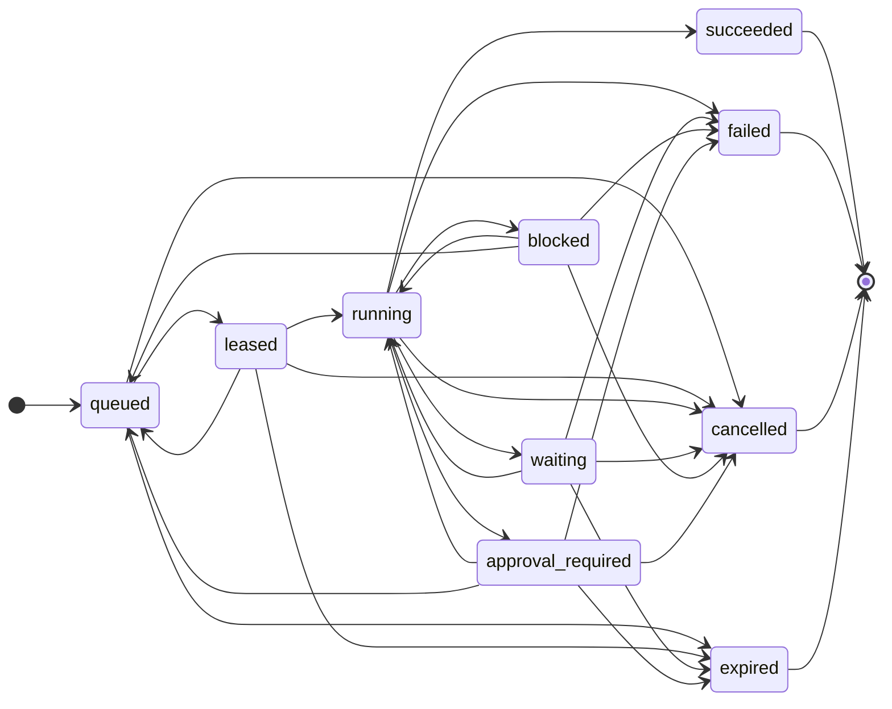
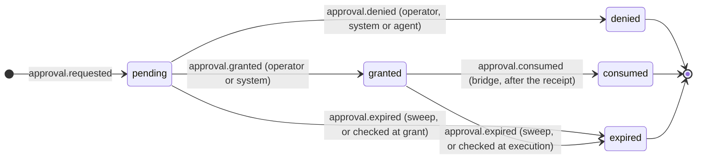
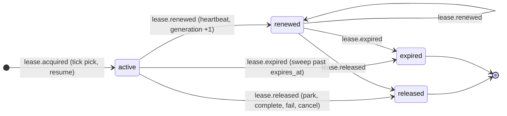

# ORDO state machine: runs, approvals, leases

Audience: developer, operator. Category: developer docs
(see [README.md → 5. Developer docs](README.md#5-developer-docs)).

Epic [#806](https://github.com/decarvalhoe/ORDO/issues/806), child
[#814](https://github.com/decarvalhoe/ORDO/issues/814). The three
transition tables below are the ones embedded in `lib/ordo_contracts.sh`
(v1, [contracts.md](contracts.md)); `ordo_contracts_transition <table>
<from> <to>` is the only judge of a move, the journal projection folds
events with the same table, and the scheduler emits the events. This page
renders the tables as diagrams, lists the events that drive them, and
collects the fail-closed rules and stop conditions the machine enforces.

## The `run` table (shared by run, task and attempt)



```
queued            -> leased | cancelled | expired
leased            -> running | queued | expired | cancelled
running           -> waiting | blocked | approval_required | succeeded | failed | cancelled
waiting           -> running | expired | cancelled | failed
blocked           -> running | queued | failed | cancelled
approval_required -> running | queued | expired | cancelled | failed
terminal: succeeded, failed, cancelled, expired
```

Reading the table:

| Group | States | Holds a lease / worker slot? | Who moves it |
| --- | --- | --- | --- |
| Pending | `queued` | no | the scheduler tick (pick), cancel, queue TTL |
| Active | `leased`, `running` | **yes** | the tick, the worker (`heartbeat`, `wait`, `block`, `require_approval`, `complete`), timeouts |
| Human wait | `waiting`, `blocked`, `approval_required` | **no** — released on entry | `resume` (new lease, same attempt) or `resume --requeue`, wait deadline, cancel, fail |
| Terminal | `succeeded`, `failed`, `cancelled`, `expired` | no | nobody: every move out is refused (exit 5 `invalid_transition`) |

Two absent edges shape the whole behaviour: `running -> queued` does not
exist, so a run that loses its lease or times out passes through `blocked`
(with a `blocker.raised` of type `lease_expired`, `timeout`, `owner_dead` or
`runtime_start_failed`) and is then `run.requeued` — the journal shows the
full path; and `queued -> failed` does not exist, so a queued run whose
budget is already exhausted is `expired` with `reason=budget_exhausted`. No
state self-transitions. Adding an edge is an additive contract change;
removing one is breaking (persisted histories would fail replay).

## The `approval` table



An approval is bound to one run, one action (`pr.merge`, `issue.comment`,
…), one principal, one policy version, one idempotency key and one expiry.
Expiring is a state change the approval module decides, never a silent
timeout; a granted approval past `expires_at` is marked expired by whatever
touches it first (`sweep`, `grant`, the bridge). See
[approvals.md](approvals.md) for the re-authorisation checklist the bridge
runs between `granted` and `consumed`.

## The `lease` table



A lease is exclusive per run (a second `acquire` while a live lease exists
is exit 5 `conflict`), carries `owner = <worker>@<host>:<pid>`, a TTL
(`ORDO_SCHED_LEASE_TTL`, 300 s) and a `generation` that holders compare to
detect that they lost it. A renew or release of an `expired` lease is exit 8
`lease_lost`; of a live lease past `expires_at` not yet swept, exit 8
`lease_stale`. Every lease change is journaled on the run in the same
transaction as the row update.

## Events that drive the machine

The journal projection is a pure fold over the run's events
([journal.md → Projection semantics](journal.md#projection-semantics)).
The types below are the vocabulary; anything else is counted and ignored
(forward compatible).

| Event type | Emitted by | Effect on the projection |
| --- | --- | --- |
| `run.created`, `run.updated` | scheduler `enqueue`; planners / provider adapters for `metadata.readiness` | title, ticket, project, budgets, dispatch, metadata merge |
| `run.leased`, `run.started` / `run.running` / `run.resumed`, `run.waiting`, `run.blocked`, `run.approval_required`, `run.requeued`, `run.succeeded`, `run.failed`, `run.cancelled`, `run.expired` | scheduler (tick, worker calls, authority calls) | transition to the named state, checked against the `run` table |
| `run.transition` | operators, recovery (corrective event) | transition to `payload.to` |
| `run.dispatched` | dispatch path | `dispatch` block (agent, ticket, branch, workdir …) — the source of the legacy `assignments.json` row |
| `run.budget` | scheduler heartbeat / `report_usage` | `budget.max_*` override and `usage.*` counters |
| `attempt.started` | scheduler on pick | `attempts_used` +1 (never reset) |
| `blocker.raised` / `blocker.resolved` | scheduler (lease loss, timeout, dead owner), operators | open / resolve a blocker; open blockers make a run not ready |
| `lease.acquired` / `lease.renewed` / `lease.released` / `lease.expired` | journal lease CRUD | mirror of the last lease |
| `approval.requested` / `approval.granted` / `approval.denied` / `approval.consumed` / `approval.expired` | approval module | mirror of the last approval |
| `policy.decided` | approval bridge, actor-type refusals | the deterministic verdict (`allow` / `deny` + reasons) that preceded a decision |
| `approval_bridge.requested` / `approval_bridge.executed` (`mutation=true`) / `approval_bridge.execution_failed` | approval bridge | the mutation record; `executed` carries the idempotency key |
| `provider.read`, `provider.mutation_delivered` (`mutation=true`) | evaluation harness | provider traffic of a scenario (not used by production paths) |
| `artifact.recorded` | evidence collection | evidence by reference |

A refused transition inside the fold (for example a replayed history that
contains `running -> queued`) does not crash and does not move the state:
it increments `counters.invalid_transitions` and opens a blocker of type
`invalid_transition` so the anomaly is visible and the run cannot be picked.

## Fail-closed rules

Each rule below is where "when in doubt, refuse" is written down, with the
exit code an operator sees and the test that pins it.

| Rule | Where | Exit | Pinned by |
| --- | --- | --- | --- |
| A queued run is picked only when every `depends_on` run is `succeeded`, any `metadata.readiness` says `state == "ready"` (missing, `unknown`, malformed → not ready) and no blocker is open. A blocked run that is not ready cannot be resumed. | `ordo_scheduler_ready` | 3 `fail_closed` | `tests/ordo_scheduler.bats`, scenario `blocked_run` |
| An actor of type `model` may request but never grant, deny or execute an approval; the refusal is journaled as a `policy_decision` deny. | `lib/ordo_approval.sh` | 3 `policy_refused` (`actor_type_not_allowed`) | `tests/ordo_approval.bats`, `policy_compliance` scoring |
| Before executing, the bridge re-checks actor type, run state (unknown run = refuse), grant, expiry now, policy version now, action and pinned arguments, principal. First failure wins. | `ordo_approval_authorize_and_run` | 3 `policy_refused` (`details.reason`) | `tests/ordo_approval.bats`, scenario `approval_expiry` |
| A mutation without `--idempotency-key` never reaches a backend; a known key returns the recorded receipt without calling the forge. | `lib/ordo_provider_adapter.sh` | 2 `usage`; replay is exit 0 with `details.replayed=true` | `tests/ordo_provider_adapter.bats`, scenario `duplicate_delivery` |
| The external mutation gate is audit-only by default; a scope not listed in `ORCH_EXTERNAL_PR_MUTATIONS` is refused before the backend is called. | `external_pr_mutation_assert` | 3 `policy_refused` (`authorize_via`) | `tests/ordo_provider_adapter.bats`, the [demo](demo.md) |
| Invalid contract objects, unknown states, unknown tables and validator crashes all fail; there is no permissive mode. | `ordo_contracts_validate` | 5 `invalid_contract` / 1 `internal_error` | `tests/ordo_contracts.bats` |
| A journal write that dies before `COMMIT` leaves no row and no sequence gap. | `ordo_journal_*` (`BEGIN IMMEDIATE`, WAL, `synchronous=FULL`) | — | `tests/ordo_journal.bats` (`ORDO_JOURNAL_FAULT`), scenario `process_crash` |
| A forge without an Actions API answers `run_list` with an empty list and `details.capability="unsupported"` — "no evidence", never "ready". | REST adapters | 0 | `tests/ordo_provider_adapter_forgejo.bats` |
| A token file readable by group or other is refused before any request. | `lib/ordo_provider_adapter_http.sh` | 3 `refused` (`token_file_permissive`) | REST adapter suites |
| A registered adapter whose file is missing is `provider_not_available`, not a policy question. | provider registry | 6 | `tests/ordo_provider_adapter.bats` |
| Budget exhaustion releases the lease and fails (or expires) the run; the caller cannot continue. | `ordo_scheduler_budgets` | 7 `budget_exhausted` | scenario `budget_exhausted` |
| A worker-side call from a caller that does not own the live lease is refused. | scheduler worker calls | 8 `lease_lost` / `lease_stale` | `tests/ordo_scheduler.bats`, scenario `stale_lease` |

## Stop conditions of the plan, and where the machine enforces them

The handoff plan (`.work/issue-pack-ordo-agentic-evolution-20260911.md`)
lists conditions under which the whole evolution must halt. They are not
aspirations; each maps to something above that would have to be broken:

| Stop condition | What would have to change |
| --- | --- |
| The new core requires rewriting existing scripts. | Any routed script in `lib/ordo_cli.sh` stops being the reference implementation. Today every `ordo` command routes verbatim ([cli.md](cli.md)). |
| A model gets direct authorisation over external mutations. | The `actor.type == "model"` refusals in grant / deny / execute, or the schema requirement of an idempotency key on mutating events. |
| Event replay can repeat a non-idempotent side effect. | The idempotency ledger consulted before the gate, or the journal's global `UNIQUE(idempotency_key)`. |
| State migration cannot reproduce pre-migration status output. | The compat export's byte-for-byte `assignments.json` test. |
| The scheduler silently converts missing provider data into readiness. | `ordo_scheduler_ready` treating a missing or `unknown` readiness as ready. |
| MCP tool metadata is treated as trusted authorisation. | Any policy decision reading a tool descriptor instead of the gate and the approval record ([delegation-guide.md](delegation-guide.md)). |
| A child grows beyond one reviewable deliverable. | Process, not code: each module has one page and one Bats file. |

When a new path is uncertain, the existing fail-closed behaviour wins: the
scheduler skips instead of picking, the bridge refuses instead of executing,
the adapter returns "unsupported" instead of guessing.

## Exit codes at a glance

`0` ok · `1` generic · `2` usage · `3` refused / fail-closed · `4` not found ·
`5` invalid state / transition / conflict · `6` missing dependency or not yet
available · `7` budget exhausted · `8` lease lost / stale. Full table and
error-object shape: [../exit-codes.md](../exit-codes.md#agentic-control-plane-scriptsordosh-and-libordo_sh).
